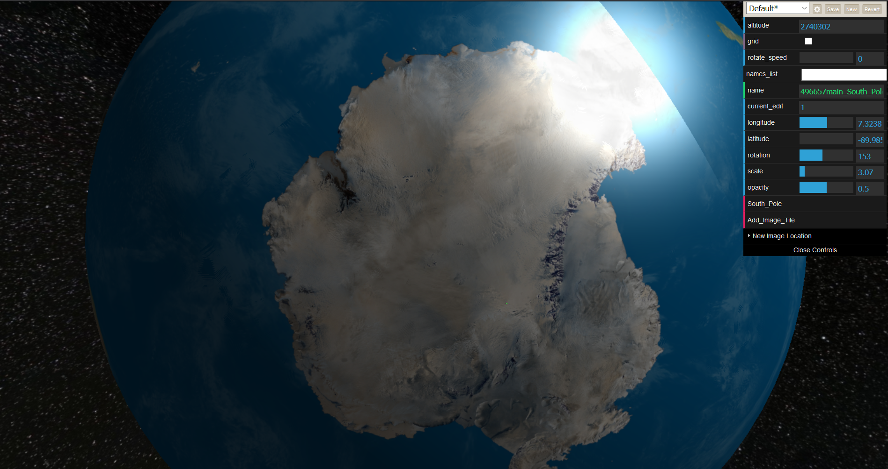

## WebGL Earth mapping experiment

# EARTH WEB GL

This is a simple Earth explorer, like google earth, but made specifically for tiling images squarly, any where,
specifically, the south pole areas, where google does a poor job at mapping.

This is also interactive, so you can edit/move/rotate etc.. the built in images.

Theres a beta ADD button to add your own images/urls to it, and stored
in your browser, then later who knows, maybe some online DB store.

# CONTROLS

Keyboard arrows to move your tile lat/long values.
< >  keys to rotate
TAB  to change tiles
PG Up/Down  to change scale factor.

Enjoy

